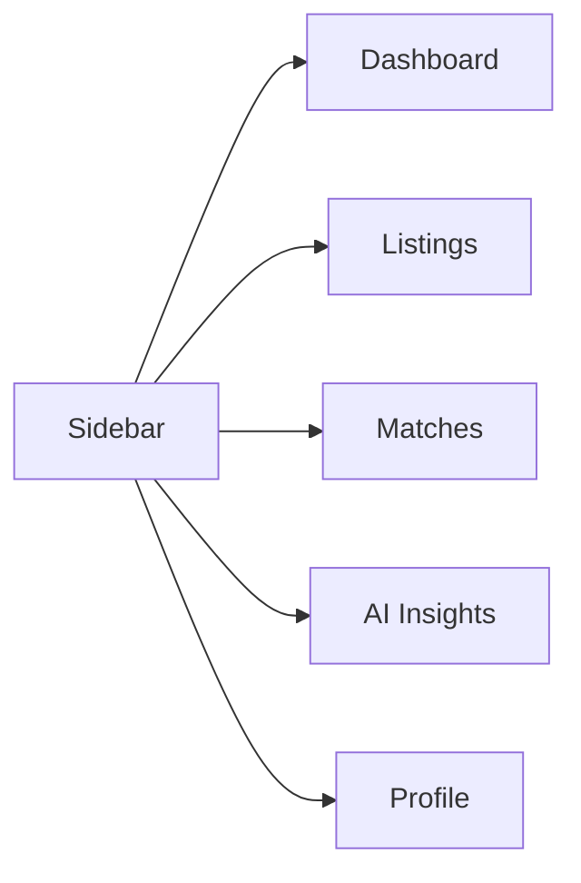

# WasteStream AI — Dashboard specification & implementation plan

This document captures the product intent for the logged-in dashboard (hackathon / demo focus), maps it to the current codebase, and proposes data contracts and API work for a follow-up implementation pass.

---

## 1. Overview & goals

**WasteStream AI** is an AI-assisted marketplace that **intelligently connects waste providers with recyclers**. Judges should land on **Dashboard Home** and immediately understand: listings exist nearby (or from “my” supply), **match scores** explain fit, and **AI panels** surface opportunities and preparation tips—not generic CRUD with a chat bolt-on.

Design principles: **simple sidebar**, **fast scanning**, **role-aware home** (`recycler` vs `waste-provider`), **AI visible on Home and on a dedicated insights/analysis flow**.

---

## 2. Information architecture — sidebar

Primary navigation (five items only):

| Order | Label       | Purpose                                      |
| ----- | ----------- | -------------------------------------------- |
| 1     | Dashboard   | Role-aware home; hero message + stats + AI   |
| 2     | Listings    | Marketplace; create + browse + actions       |
| 3     | Matches     | Compatibility-focused connections            |
| 4     | AI Insights | Dedicated AI analysis / recommendations hub  |
| 5     | Profile     | Minimal account + preferences summary        |



### Gap vs current UI

The existing shell defines sidebar items as **`Overview`**, **`Listings`**, **`Matches`**, **`Routes`**, **`Settings`** in [`web/components/dashboard/dashboard-shell.tsx`](web/components/dashboard/dashboard-shell.tsx) (`navigation` constant, ~lines 30–36). Implementation should **rename/replace** these to match the table above:

- `Overview` → **Dashboard**
- Remove **Routes** and **Settings** from primary nav (or fold secondary actions into header/footer if still needed)
- Add **AI Insights** and **Profile** as first-class routes

Entry remains [`web/app/dashboard/page.tsx`](web/app/dashboard/page.tsx) wrapping [`DashboardShell`](web/components/dashboard/dashboard-shell.tsx) inside [`ProtectedShell`](web/components/auth/protected-shell.tsx).

---

## 3. Role model

Roles are already modeled end-to-end:

- **Database:** [`api/src/database/schema.ts`](api/src/database/schema.ts) — `user_profile.role`, plus `recycler_profile` / `waste_provider_profile` and junction tables `recycler_waste_type` / `waste_provider_waste_type` linked to `waste_type`.
- **Client types:** [`web/lib/auth.ts`](web/lib/auth.ts) — `PersonalProfile.role` is `"recycler" | "waste-provider"`; `BackendAuthProfile` exposes `personalProfile`, `roleProfile`, `wasteTypes`, and `meta` (pickup/units/condition options).

**Dashboard routing logic:** branch UI on `session.personalProfile?.role` (and ensure onboarding-complete users only; reuse existing auth/session checks).

---

## 4. Page 1 — Dashboard Home (most important)

**Above-the-fold message (both roles):** one short line, e.g.  
*“This platform intelligently connects waste providers and recyclers.”*

### 4.A Recycler dashboard

**A. Stats cards (3–4 max)**

| Card                     | Example metric | Notes                          |
| ------------------------ | -------------- | ------------------------------ |
| Active listings nearby   | e.g. `24`      | Geo/city filter vs service area |
| Waste collected          | e.g. `1.2 t`   | Period optional (30d)           |
| Match requests           | e.g. `8`       | Pending inbound interests       |
| Accepted waste categories| e.g. `5`       | From profile waste types        |

**B. Nearby waste listings — card list**

Each row/card shows:

- Waste type  
- Quantity  
- Location (city/state as in listing)  
- **Match score** (e.g. `92% Match`)

Actions:

- **View** → listing detail (modal or `/dashboard/listings/[id]`)
- **Accept interest** → creates or confirms a match / interest record (API TBD)

Example card copy:

> **PET Plastic** · `50kg` · Lagos · **92% Match**  
> [View] [Accept interest]

**C. AI recommendation panel (“hackathon sauce”)**

Highlight pattern:

> **AI Insight:** 3 high-value plastic listings detected near Ikeja.  
> **Potential estimated value:** ₦25,000  

Optional secondary line: link **“See on Listings”** or open AI Insights with filters pre-set.

---

### 4.B Waste provider dashboard

**A. Stats cards (3–4 max)**

| Card                  | Example        |
| --------------------- | -------------- |
| Listings created      | Count          |
| Interested recyclers  | Unique or sum  |
| Estimated waste value | ₦ range or sum |
| Waste categories      | Count or chips |

**B. My waste listings — cards**

Each card:

- Waste type  
- Quantity  
- Status (e.g. draft / active / matched)  
- Interested recyclers (count or avatars)

**C. AI suggestions**

Example:

> **AI Suggestion:** Sorted plastics may increase recycling value by **30%**.

Keep copy **short** and **actionable**.

---

## 5. Page 2 — Listings

**Purpose:** This is the **marketplace**—highest traffic after Home.

**Features:**

1. **Create listing** — primary CTA (button top-right); opens form or wizard (image upload hooks into AI Analysis flow).
2. **Listing cards** — grid or list; each shows:
   - Image  
   - Waste type  
   - Quantity  
   - Location  
   - Condition  
   - Date  

**Actions per card:**

- View details  
- Contact  
- Express interest  

**Role nuances:**

- Recyclers: emphasize **nearby** + **match score** on cards or detail.  
- Providers: emphasize **my listings** + status + interest count (could be a tab on same route).

Suggested route shape: `web/app/dashboard/listings/page.tsx` (+ dynamic segment for detail).

---

## 6. Page 3 — AI Analysis Panel (high value)

**When:** Triggered when user **uploads waste** (create listing or dedicated “Analyze” entry).

**Show:**

| Section              | Example                                              |
| -------------------- | ---------------------------------------------------- |
| Detected waste type  | PET Plastic Bottles                                  |
| Estimated recyclability | High / Medium / Low + one-line rationale        |
| Estimated market value | ₦500–₦900                                          |
| Recommended recyclers | Short list (name + distance + match %)             |

**Recommended action** (prep tip):

> Separate caps for higher recycling efficiency.

This differentiates from “CRUD + ChatGPT”: structured fields, **ranges**, **recycler linkage**, and **logistics-aware** tips.

**Integration notes:**

- Image → upload to storage or send as base64 to API → vision/classification model (provider TBD).  
- **Recommended recyclers** should query users/listings where `wasteTypesAccepted` overlaps detected type and optional geo radius—see [`recycler_waste_type`](api/src/database/schema.ts).

Dedicated route: e.g. `web/app/dashboard/ai-insights/page.tsx` or nested under listings create flow.

---

## 7. Page 4 — Matches

**Purpose:** Prove the **matching concept** is central.

**Show cards** for recycler ↔ provider (or listing ↔ counterpart):

- Match **percentage** (e.g. `92% Match`)  
- **Compatibility reasons** as checkmarks, e.g.  
  - ✓ Accepts plastics  
  - ✓ Within 10km  
  - ✓ Pickup available  

Data should mirror profile fields already collected at onboarding ([`RecyclerRoleProfile`](web/lib/auth.ts) pickup, service city/state, waste types).

Suggested route: `web/app/dashboard/matches/page.tsx`.

---

## 8. Page 5 — Profile

**Keep minimal** (demos rarely dwell here):

- User info (name, email, phone from [`PersonalProfile`](web/lib/auth.ts))  
- Waste categories (accepted or provided, from role profile + `wasteTypes`)  
- Preferences (pickup availability, capacity/quantity summaries)  
- Location (service area or provider city/state/country)

Optional: single **Edit** deep-link back to onboarding or a slim edit form—out of scope for first polish if time-constrained.

Suggested route: `web/app/dashboard/profile/page.tsx`.

---

## 9. Component inventory

### Existing ([`web/components/ui/`](web/components/ui/))

| Component   | Use on dashboard                          |
| ----------- | ----------------------------------------- |
| `avatar`    | Profile header, interested recyclers      |
| `badge`     | Status, match %, categories               |
| `button`    | CTAs (Create listing, Express interest)   |
| `card`      | Stats, listings, matches                  |
| `command`   | Search/filter combos (optional)           |
| `input`     | Forms                                     |
| `label`     | Forms                                     |
| `select`    | Filters, waste type                       |
| `textarea`  | Listing notes                             |

Also reuse [`DashboardShell`](web/components/dashboard/dashboard-shell.tsx) layout patterns (sidebar, top bar with bell + avatar).

### To add (suggested)

| Component              | Responsibility                          |
| ---------------------- | --------------------------------------- |
| `ListingCard`          | Image + meta + actions                  |
| `MatchCard`            | Score + bullet reasons                  |
| `StatCard`             | Icon + value + label (3–4 per home)     |
| `AIInsightPanel`       | Home teaser + link to full AI page      |
| `AIAnalysisResult`     | Structured output after upload            |
| `WasteUploadDropzone`  | File pick + progress + trigger analysis |
| `DashboardNav`         | Active route + mobile drawer sync       |

---

## 10. Data contracts (proposed)

Drop into [`web/types/`](web/types/) when implementing. IDs as `string` (UUID) unless you standardize on numeric PKs in DB.

### TypeScript

```typescript
// web/types/marketplace.ts (proposed)

export type ListingStatus = "draft" | "active" | "paused" | "matched" | "closed";

export type WasteListing = {
  id: string;
  providerUserId: string;
  wasteTypeSlug: string;
  wasteTypeLabel: string;
  quantityAmount: string;
  quantityUnit: string;
  condition: string;
  location: {
    city: string;
    state: string;
    country: string;
    /** Optional lat/lng for distance scoring */
    coordinates?: { lat: number; lng: number };
  };
  imageUrl: string | null;
  status: ListingStatus;
  createdAt: string;
  updatedAt: string;
  /** Denormalized for cards */
  interestedRecyclerCount?: number;
};

export type MatchReason = {
  label: string;
  satisfied: boolean;
};

export type MarketplaceMatch = {
  id: string;
  listingId: string;
  recyclerUserId: string;
  providerUserId: string;
  matchScorePercent: number;
  reasons: MatchReason[];
  createdAt: string;
};

export type AIAnalysis = {
  id: string;
  listingId?: string;
  sourceImageUrl?: string;
  detectedWasteTypeLabel: string;
  detectedWasteTypeSlug?: string;
  recyclability: "high" | "medium" | "low";
  recyclabilityNote?: string;
  estimatedValueMinNgn: number;
  estimatedValueMaxNgn: number;
  recommendedAction: string;
  recommendedRecyclerUserIds?: string[];
  analyzedAt: string;
};
```

### Drizzle sketch (add to [`api/src/database/schema.ts`](api/src/database/schema.ts))

Conceptual tables (names illustrative):

- `waste_listing` — FK `provider_user_id` → `user.id`; waste type FK or slug; quantity; condition; location fields; image URL; status; timestamps.  
- `listing_interest` — `listing_id`, `recycler_user_id`, status (`pending` | `accepted`), timestamps.  
- `match` or computed view — optional persisted row or derived from listing + profiles + scoring job.  
- `ai_analysis` — FK optional listing; JSON or columns for detection + value range + recommendations.

Indexes: `(provider_user_id)`, `(status, city)`, `(waste_type_id)` for marketplace queries.

---

## 11. API endpoints (Express)

Base URL pattern already implied by [`web/lib/auth.ts`](web/lib/auth.ts) (`apiBaseUrl` + `/v1`). Proposed REST-style routes under [`api/src/routes/`](api/src/routes/) with new controllers:

| Method | Path                         | Role        | Purpose                          |
| ------ | ---------------------------- | ----------- | -------------------------------- |
| GET    | `/v1/listings`               | Auth        | Marketplace feed + filters       |
| POST   | `/v1/listings`               | Provider    | Create listing                   |
| GET    | `/v1/listings/:id`           | Auth        | Detail                           |
| PATCH  | `/v1/listings/:id`           | Provider    | Update / status                  |
| POST   | `/v1/listings/:id/interest`  | Recycler    | Express interest                 |
| GET    | `/v1/matches`                | Auth        | Matches for current user         |
| POST   | `/v1/ai/analyze`             | Auth        | Image → `AIAnalysis`             |
| GET    | `/v1/dashboard/recycler`     | Recycler    | Aggregated stats + nearby teaser |
| GET    | `/v1/dashboard/provider`     | Provider    | Aggregated stats + my listings   |

Secure all with existing session middleware ([`api/src/lib/request-auth.ts`](api/src/lib/request-auth.ts) or equivalent).

---

## 12. Implementation milestones

1. **Nav & routes** — Align sidebar labels/routes with §2; add placeholder pages for Listings, Matches, AI Insights, Profile.  
2. **Dashboard Home** — Split recycler vs provider layouts; 3–4 stat cards; wire mock data then API.  
3. **Listings** — Card grid + Create listing modal + detail view.  
4. **Matches** — Cards with `%` and reason list from API or mocked scorer.  
5. **AI** — Upload → analysis result UI; hook stub then real model.  
6. **Persistence** — Drizzle migrations for listings/interests/analysis; connect dashboard aggregates.

---

## 13. Demo script for judges (~90 seconds)

1. **Login** as recycler → **Dashboard**: read the one-line value prop; point at **3–4 stats** and **AI Insight** (“high-value plastic near Ikeja, ₦25k potential”).  
2. Open **Listings** → scroll **marketplace cards** (image, type, qty, location, condition, date) → **Express interest** on one listing.  
3. Open **Matches** → show **92% Match** with **✓ reasons** (material, distance, pickup).  
4. **Logout / switch** to waste provider → **Dashboard**: **My listings** + **AI Suggestion** (e.g. sorted plastics +30% value).  
5. **Create listing** → upload photo → **AI Analysis**: detected type, recyclability, **₦ range**, recommended action, recommended recyclers.  
6. **Profile** — glance at categories and location; “back to Dashboard” for the closer: *intelligent connection, not just a form.*

---

## Appendix — related files (quick reference)

| Area        | Path |
| ----------- | ---- |
| Dashboard entry | [`web/app/dashboard/page.tsx`](web/app/dashboard/page.tsx) |
| Shell / sidebar | [`web/components/dashboard/dashboard-shell.tsx`](web/components/dashboard/dashboard-shell.tsx) |
| Auth profile types | [`web/lib/auth.ts`](web/lib/auth.ts) |
| DB schema | [`api/src/database/schema.ts`](api/src/database/schema.ts) |
| Waste type UI fallback | [`web/constants/onboarding.ts`](web/constants/onboarding.ts) |
| Waste type TS | [`web/types/waste.ts`](web/types/waste.ts) |
